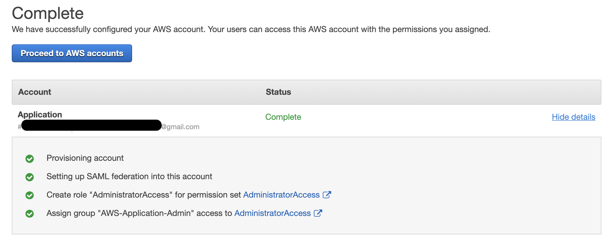

# aws-organization-sso-demo 🐳

## reference
[awsstudygroup](https://000012.awsstudygroup.com/vi)

## 4 groups

## structure
- see on `AWS Organization`

- see on `AWS SSO`

### A) Permissions sets=`AdministratorAccess`
- OU=`Application Unit` > username=`Application` > groupname=`AWS-Application-Admin`

- OU=`Security Unit` > username=`Security` > groupname=`AWS-Security-Admin`

### A) Permissions sets=`SecurityAudit`
- OU=`Logging Unit` > username=`Logging` > groupname=`AWS-Logging-Read-Only`

---

- => after login by username=`Logging`, can NOT access full like the others!

## Super-User
- [create](https://000012.awsstudygroup.com/vi/2-setup-aws-sso/2.2-add-user-group/)

- after created will have login information

- after login

- click `Logging > Management console`

