# aws-organization-sso-demo 🐳

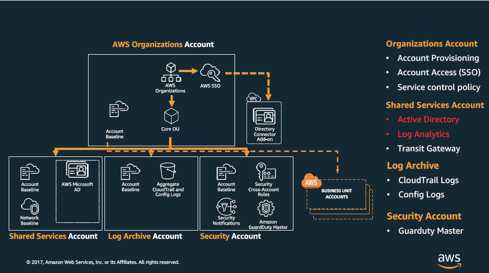

## reference
[awsstudygroup](https://000012.awsstudygroup.com/vi)

## structure
- see on `AWS Organization`
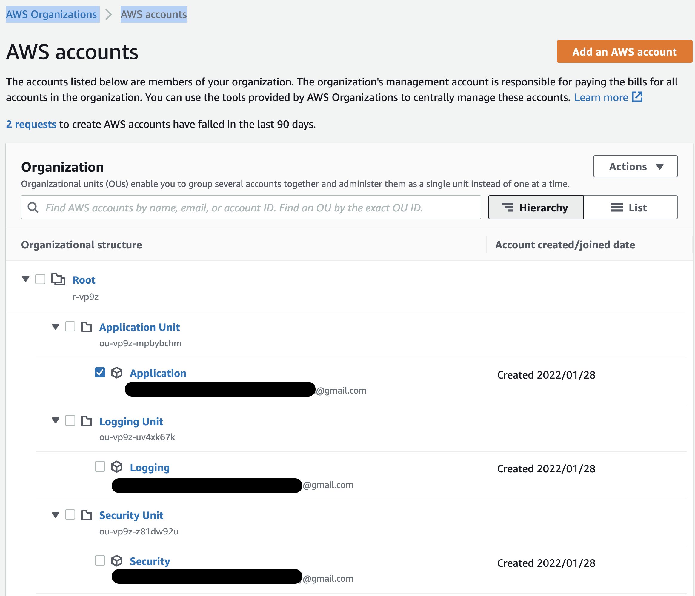
- see on `AWS SSO`
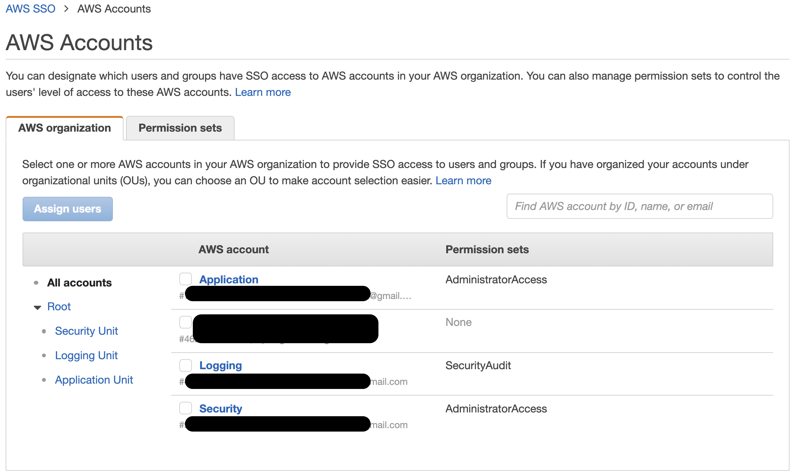
### A) Permissions sets=`AdministratorAccess`
- OU=`Application Unit` > username=`Application` > groupname=`AWS-Application-Admin`
- OU=`Security Unit` > username=`Security` > groupname=`AWS-Security-Admin`
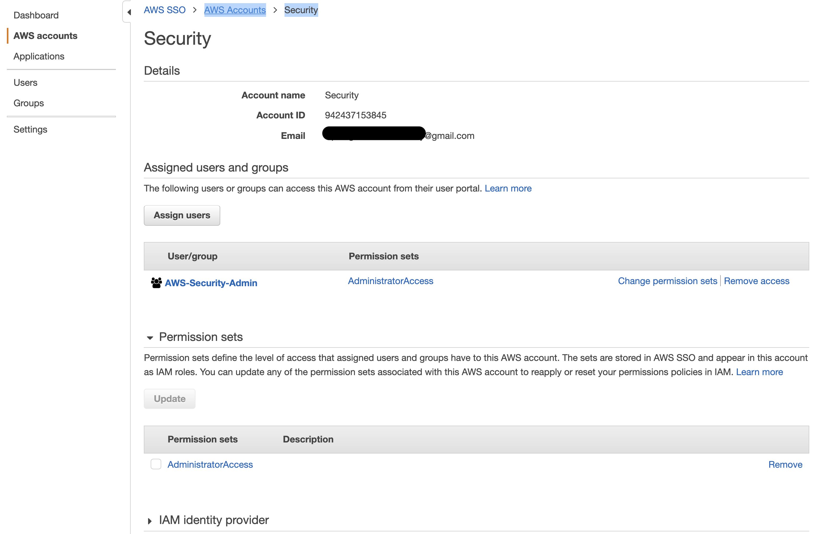
### B) Permissions sets=`SecurityAudit`
- OU=`Logging Unit` > username=`Logging` > groupname=`AWS-Logging-Read-Only`
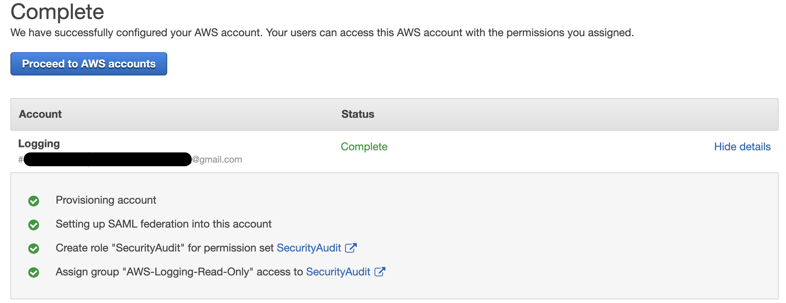
---
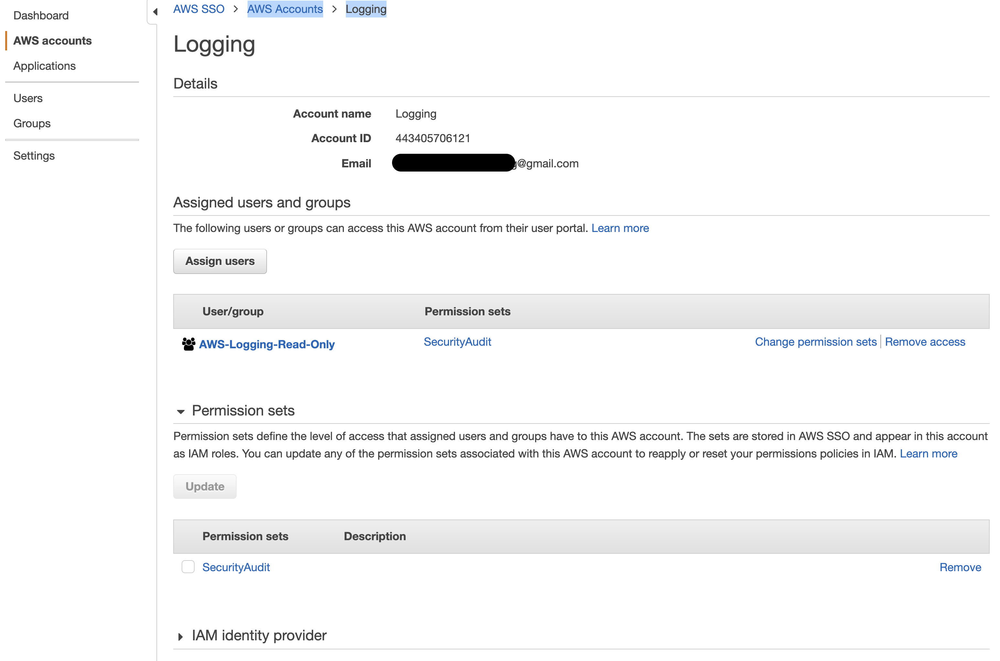
- lastly, after login by username=`Logging` (get PW by workaround way: click `Forgot PW`), at Dashboard can NOT access full services like the others!

## AWS SSO

### A) Thêm Users và Groups
#### Users
- `Super-User` sẽ có quyền truy cập vào tất cả các group
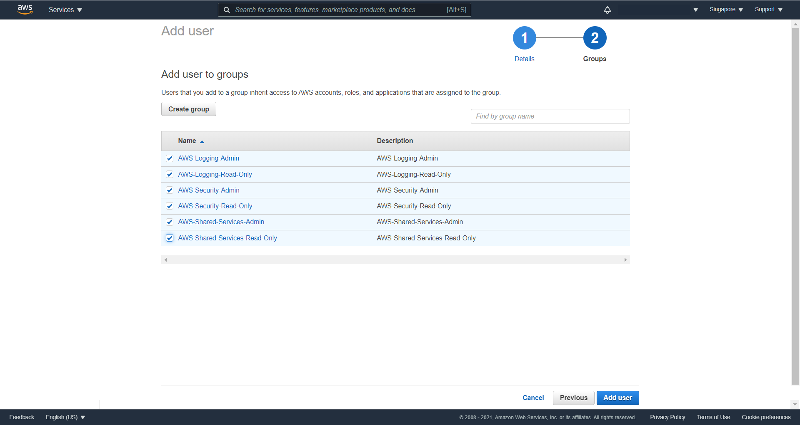
- after create `Super-User`:
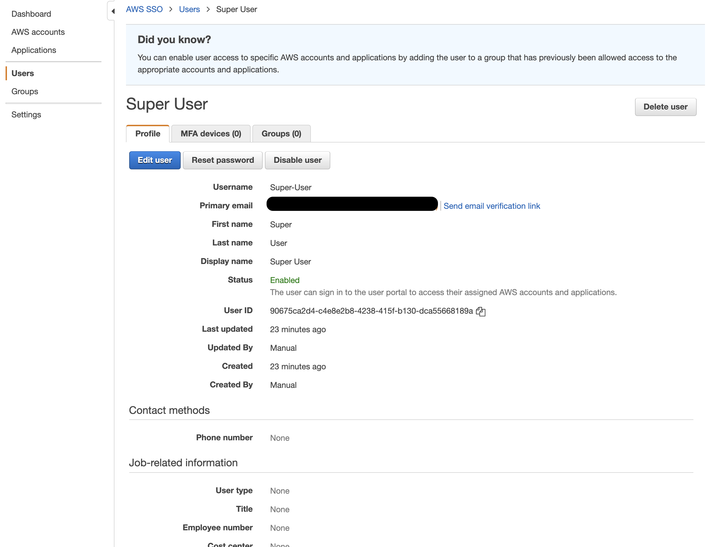
#### Groups
- 4 groups:
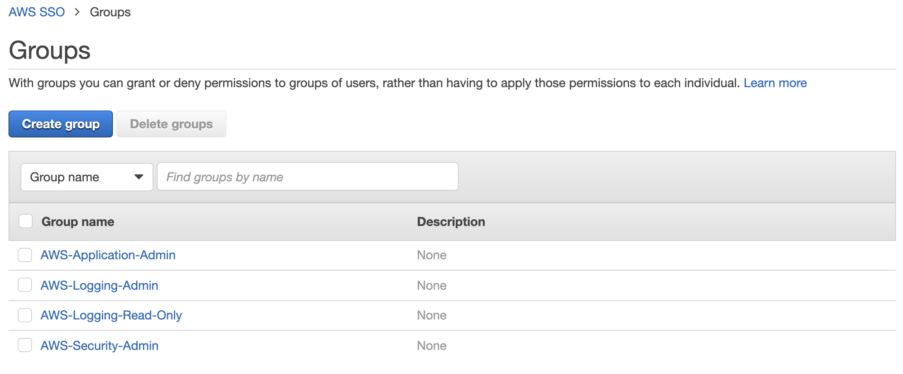
### B) Tạo Permission Set
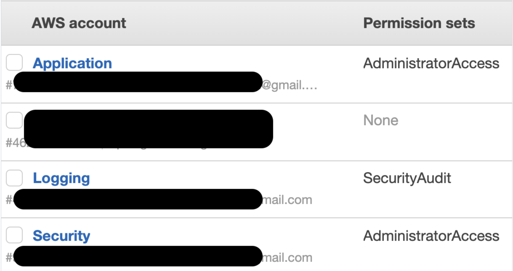
### C) Gán quyền
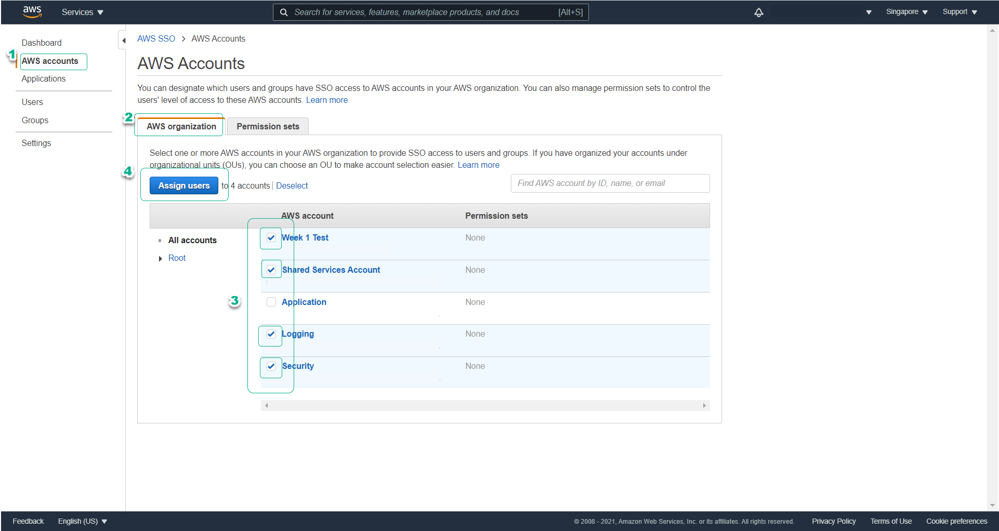
### check by Super-User
- after created will have login information
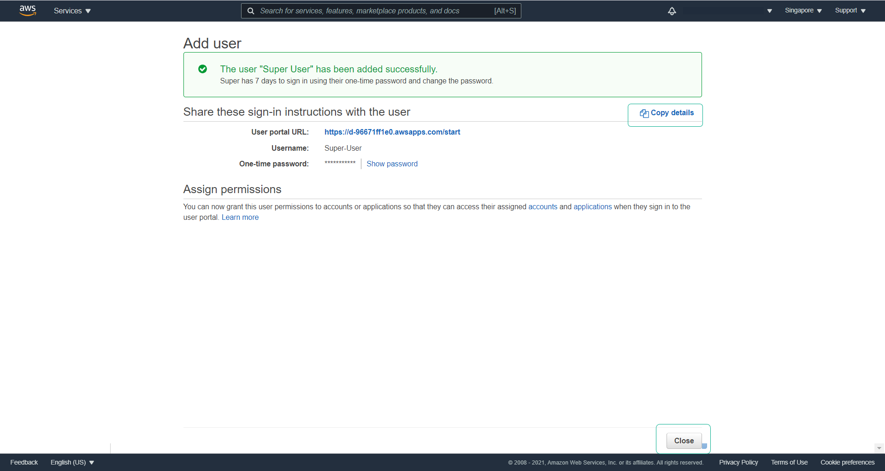
- must change PW in 1st login

- after login
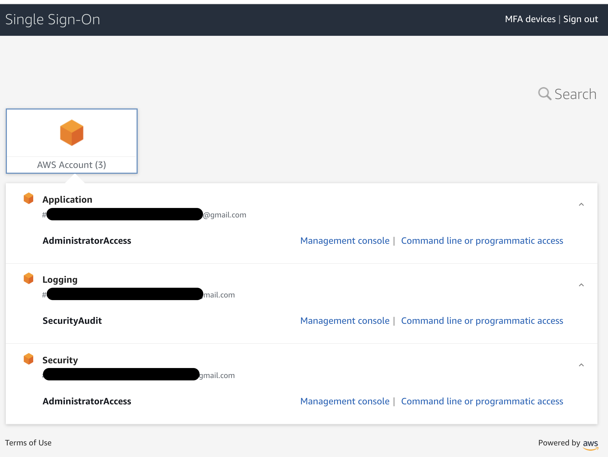
- click `Logging > Management console`
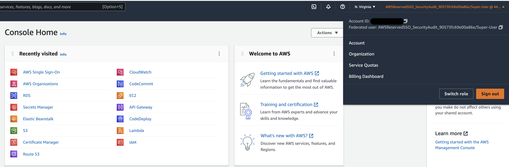
- => can login SSO at username=`Logging` by `Super-User`. At top right corner: Federated user=`AWSReservedSSO_SecurityAudit_xxx`
- at Dashboard can access full services like `Super-User`

